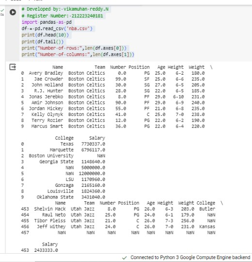
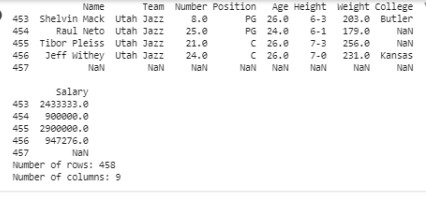

# Read-from-CSV

## AIM:

## ALGORITHM:
## Step 1:
Import pandas as pd.

## Step 2:
Read the CSV file using read_csv method.

## Step 3:
Use head and tail method to get the required contents from the file.

## Step 4:
Use len() method to get the number of rows and columns.

## Step 5:
Print the output
## PROGRAM:
```py
#Program for reading content from a CSV file.
# Developed by: Vikamuhan reddy.N
# Register Number: 212223240181

import pandas as pd
df = pd.read_csv('nba.csv')
print(df.head(10))
print(df.tail())
print("Number of rows:",len(df.axes[0]))
print("Number of columns:",len(df.axes[1]))
```

## OUTPUT:



## RESULT:
The program for reading the csv using pandas as successfully executed